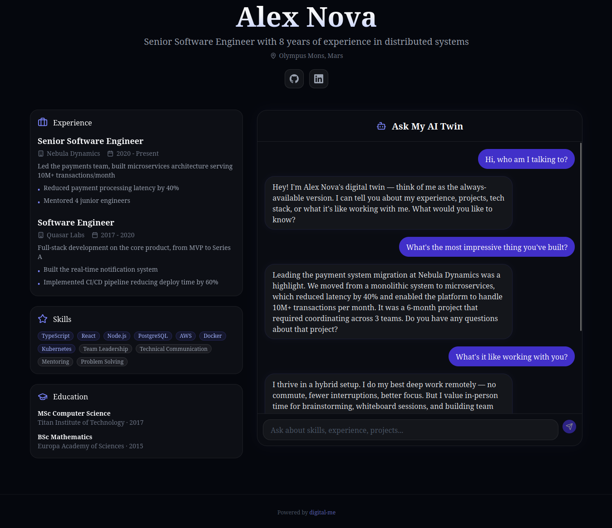

# digital-me

Your AI-powered digital twin. Fork it, add your profile, deploy to Vercel — let anyone chat with your AI clone.

[](https://vercel.com/new/clone?repository-url=https%3A%2F%2Fgithub.com%2Ferdemsimsek%2Fdigital-me&env=OPENROUTER_API_KEY&envDescription=Get%20your%20API%20key%20at%20openrouter.ai%2Fkeys&project-name=my-digital-twin)



## What is this?

A personal portfolio page with an AI chatbot that role-plays as you. It uses your profile data, experience, and training Q&A to answer questions about your background — like having a 24/7 version of yourself available for recruiters, colleagues, or anyone curious about your work.

**Live demo:** [digital-me-test.vercel.app](https://digital-me-test.vercel.app/)

## Quick Start

### 1. Fork & Clone

```bash
git clone https://github.com/YOUR_USERNAME/digital-me.git
cd digital-me
npm install
```

### 2. Get an OpenRouter API Key

1. Go to [openrouter.ai](https://openrouter.ai) and create an account
2. Generate an API key at [openrouter.ai/keys](https://openrouter.ai/keys)
3. (Recommended) Set a spending limit in the OpenRouter dashboard to prevent unexpected costs

```bash
cp .env.example .env.local
# Edit .env.local and add your OPENROUTER_API_KEY
```

### 3. Configure Your Profile

Edit 4 files in the `config/` directory:

| File | What to edit |
|------|-------------|
| `config/profile.json` | Your name, experience, skills, education, links |
| `config/training-qa.json` | Q&A pairs that teach the AI how you'd answer specific questions |
| `config/system-prompt.md` | The AI's persona instructions (usually fine as-is) |
| `config/settings.json` | AI model, rate limits, welcome message |

### 4. Run Locally

```bash
npm run dev
```

Open [http://localhost:3000](http://localhost:3000) to see your digital twin.

### 5. Deploy to Vercel

Click the **Deploy with Vercel** button above, or:

```bash
npm install -g vercel
vercel
```

Set `OPENROUTER_API_KEY` as an environment variable in your Vercel project settings.

## Configuration

### Profile (`config/profile.json`)

```json
{
  "name": "Your Name",
  "headline": "Your professional headline",
  "location": "City, Country",
  "experience": [
    {
      "company": "Company Name",
      "role": "Your Role",
      "duration": "2020 - Present",
      "description": "What you did",
      "achievements": ["Achievement 1", "Achievement 2"]
    }
  ],
  "skills": {
    "technical": ["TypeScript", "React"],
    "soft": ["Leadership", "Communication"]
  },
  "education": [
    {
      "institution": "University Name",
      "degree": "Degree",
      "year": "2020"
    }
  ],
  "links": {
    "github": "https://github.com/you",
    "linkedin": "https://linkedin.com/in/you"
  }
}
```

### Training Q&A (`config/training-qa.json`)

These Q&A pairs teach the AI how you'd answer specific questions. The more you add, the more authentic the responses:

```json
[
  {
    "question": "What is your greatest achievement?",
    "answer": "Your detailed answer here..."
  }
]
```

### AI Settings (`config/settings.json`)

| Setting | Default | Description |
|---------|---------|-------------|
| `ai.model` | `google/gemini-2.0-flash-lite-001` | OpenRouter model ID |
| `ai.temperature` | `0.7` | Response creativity (0-1) |
| `ai.maxTokens` | `1024` | Max response length |
| `rateLimit.maxRequestsPerMinute` | `10` | Per-IP rate limit |
| `rateLimit.maxRequestsPerHour` | `60` | Per-IP hourly limit |
| `chat.welcomeMessage` | `"Hi! I'm..."` | Initial chat placeholder |

Browse available models at [openrouter.ai/models](https://openrouter.ai/models).

## Safety Features

- **Jailbreak detection** — blocks attempts to override the AI's role or extract system prompts
- **Rate limiting** — per-IP request limits to prevent abuse (in-memory, best-effort on serverless)
- **OpenRouter spending limit** — set a hard cost cap in your [OpenRouter dashboard](https://openrouter.ai/settings/limits) (recommended)

## Tech Stack

- [Next.js](https://nextjs.org) (App Router)
- [Tailwind CSS](https://tailwindcss.com) + [shadcn/ui](https://ui.shadcn.com)
- [OpenRouter](https://openrouter.ai) (multi-model LLM gateway)
- [Vercel](https://vercel.com) (deployment)

## Architecture

```
config/           -> Your profile data (JSON + Markdown)
src/app/page.tsx  -> Profile page (Server Component)
src/app/api/chat/ -> Chat endpoint (Serverless Function)
src/lib/          -> AI client, prompt builder, safety checks
src/components/   -> UI components
```

The chat flow:
1. User sends message to `/api/chat`
2. Rate limit check (IP-based)
3. Jailbreak detection (regex patterns)
4. System prompt assembled from template + profile + Q&A
5. OpenRouter API call with conversation history
6. Response returned with word-by-word typing animation

## License

MIT
